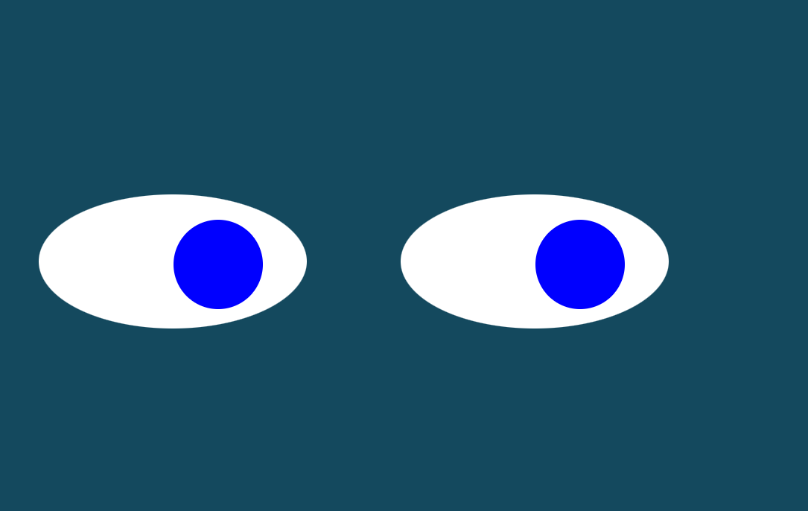

# Eyes

The Eyes exercise helped to practice using everything we have learned so far in CSS, HTML and Javascript to create shapes, color and movement. 

To see the Demo:

1) Click on "Fork" to fork the repo to your own github repo 
2) From your github repo, choose the green "Code" button and from the pull-down menu choose to "Clone" using your SSH key and copy the URL
3) Go to your local Git (I use Gitbash from Windows Terminal) and type "git clone " and then paste the URL
4) Go to your IDE (I use Visual Studio) and open the folder where you saved the repo
5) Open a blank tab on your Internet browser and drag the Eyes.html file to it
6) You can then move your cursor around your screen and the eyes will follow in the same direction

# Road Map of Future Improvements
I would like to improve this demo by adding a timer, such that after one minute only one eye follows, then after another minute only the other eye follows, and finally after another minute both eyes follow again.

# License
MIT License

Copyright (c) 2022 Aileen Marquez

Permission is hereby granted, free of charge, to any person obtaining a copy
of this software and associated documentation files (the "Software"), to deal
in the Software without restriction, including without limitation the rights
to use, copy, modify, merge, publish, distribute, sublicense, and/or sell
copies of the Software, and to permit persons to whom the Software is
furnished to do so, subject to the following conditions:

The above copyright notice and this permission notice shall be included in all
copies or substantial portions of the Software.

THE SOFTWARE IS PROVIDED "AS IS", WITHOUT WARRANTY OF ANY KIND, EXPRESS OR
IMPLIED, INCLUDING BUT NOT LIMITED TO THE WARRANTIES OF MERCHANTABILITY,
FITNESS FOR A PARTICULAR PURPOSE AND NONINFRINGEMENT. IN NO EVENT SHALL THE
AUTHORS OR COPYRIGHT HOLDERS BE LIABLE FOR ANY CLAIM, DAMAGES OR OTHER
LIABILITY, WHETHER IN AN ACTION OF CONTRACT, TORT OR OTHERWISE, ARISING FROM,
OUT OF OR IN CONNECTION WITH THE SOFTWARE OR THE USE OR OTHER DEALINGS IN THE
SOFTWARE.
